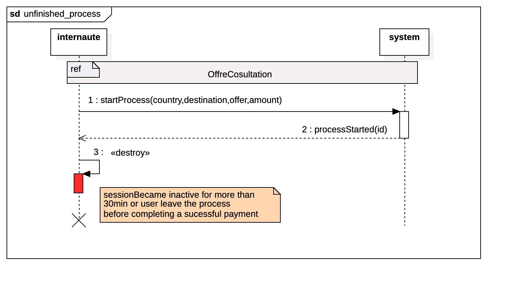
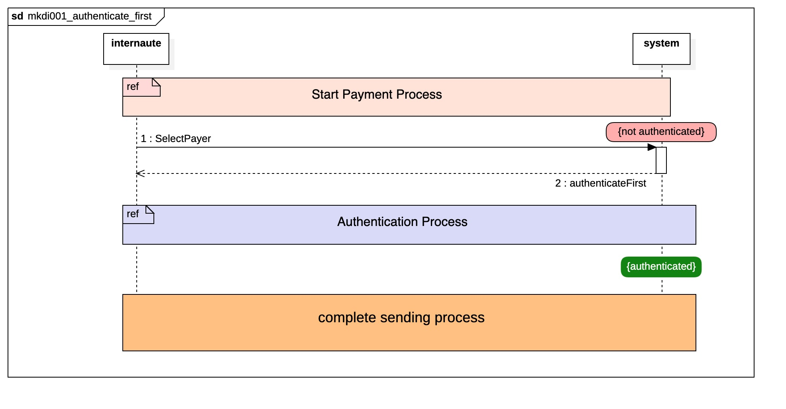

### Case 01 : Effectuer un envoi sur minkadi

### Acteur principal

- [ ] Client

### Acteurs secondaires

- [ ] Gestionnaire de taux
- [ ] Secure Payment

### Objectifs

- [ ] le client veut effectuer un envoi d'un montant X dans un pays destinataire 

### Preconditions

- [ ] le client a dejà un compte et est authentifié (voir le cas d'utilisation S'authentifier)
- [ ] Il y'a un agent disponible dans la localité selectioné
- [ ] le moyent de paiement selectioné est disponible 
- [ ] le client a ajouté un moyen de paiement
- [ ] le client a ajouté ses docuements d'identiés.

### Postconditions

- [ ] une nouvelle transaction est ajoutée en cas de succès de paiement, l'agent est notifié, le client est notifié, la transaction est ajouté dans la liste des transactions du client et de l'agent

### **Scenarios***

### **1 - Nominal
[[MKD001-Designs]]

- [ ] 1 - l'utilisateur se connecte sur le site et consulte l'offre d'envoi
	- [ ] une offre contient les taux actuel ( nouveaux utilisateur, offre exceptionnel)
	- [ ] durée de l'offre
- [ ] 2 - Commende le processus d'envoi 
	- [ ] le système lui crée un process brouillon
- [ ] 3 - Il choisit son mode paiement et le mode de livraison ( comment le destinataire sera payé)
- [ ] 4 -  choisit le lieu de livraison 
- [ ] 5 -  choisit ou ajoute un destinataire
- [ ] 6 -  Commence le processus de paiement
- [ ] 7 -  choisit ou ajoute les infos du paiment (card de créedit , paypal, etc)
- [ ] 8 -  consulte la transaction
- [ ] 9 -  partage avec le destinataire 
- [ ] 10 - Peut s'envoyer le reçu ou encore les infos de la transactions

### 1-1 Sequence Diagram

### Alternatives

### Unfinished process
	- à l'étape 2, l'utilisateur choisit d'abandonner le processus 
	- oubien la session devient inactive après 30 min
- [ ] 2a - Le client commence le processus d'envoi et abandonne le processus
### Diagram de Sequence

### Authenticate first

L'utilisateur peut faire une parti du process sans être authentifié,
mais doit être authentifié avant de pouvoir selection les points de retrait et les commencer le payment

- [ ] 2a - Le client a un compte mais n'as plas encore validé son email
	- [ ] Le client peut demander le renvoi du mail de validation pour valider son emai
	- [ ]  Le client peut changer son mail 
- [ ] 2b - Le client a un compte valide mais n'as pas encore validé son document d'identité
	- [ ] Le client doit ajouter son pièce d'identité au format pdf, image 
	- [ ] Une fois le document soumis, le document est transmis au service client pour review et validation
	- [ ] Une fois que le compte est validé, si il y'a un envoi encours qui était en pause, redirigé le client vers la finalisation d'envoi.
- [ ] 3a - Le client entre des données invalid
	- [ ] Le formulaire montre une erreur, et refuse de faire une soumission
- [ ] 5a - Le lieu de retrait choisi ne montre aucun agent qui peut payer si le moyen de paiement choisi est un retrait physique
	- [ ] Un message d'erreur est affiché pour lui proposer une alternative 
- [ ] 7a - Echec de paiement du client
	- [ ]  Toutes les informations sont enregistrées, saut les informations bancaires
	- [ ]   La transaction n'est pas créer 
	- [ ]  On propose au client de changer le moyent de paiement et le cycle se retourne au 7

